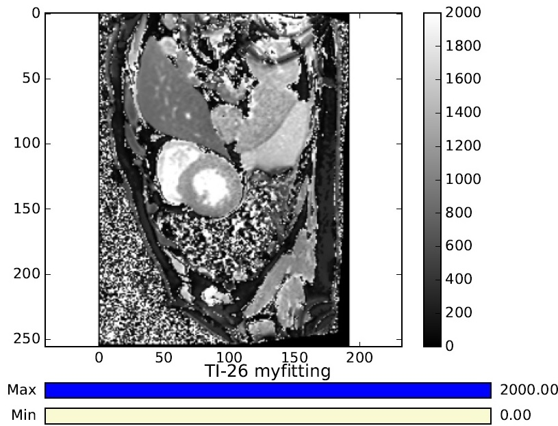

# EfficientCardiacMRI_T1_T2_Mapping
Efficient Cardiac MRI T1 T2 Mapping with the Levenberg-Marquardt method

    
     

## Contents
-	fittingCodePy: Includes the c++ code. You can build it based on the cmake files provided. This will produce a command line executable (it only works on nifti files). It will also produce a dynamic library, linked to python linked to python via boost library. The main fitting code only depends on the eigen C++ template library. 
-	pythonScripts: 'pyImage' is the python toolbox that I use to fit images. It can import dicom files directly.
This folder also includes testing scripts in python: 
**'T1mappingResults.py'** runs the fitting algorithm to all subjects and slices. It sorts out the series numbers and inversion times automatically.
**'plotResults.py'** plots the fitting results and compares them to MRmaps output
**'showFitCurve.py'** implements an interactive tool to check the fitting quality in each pixel you select with the mouse. 
